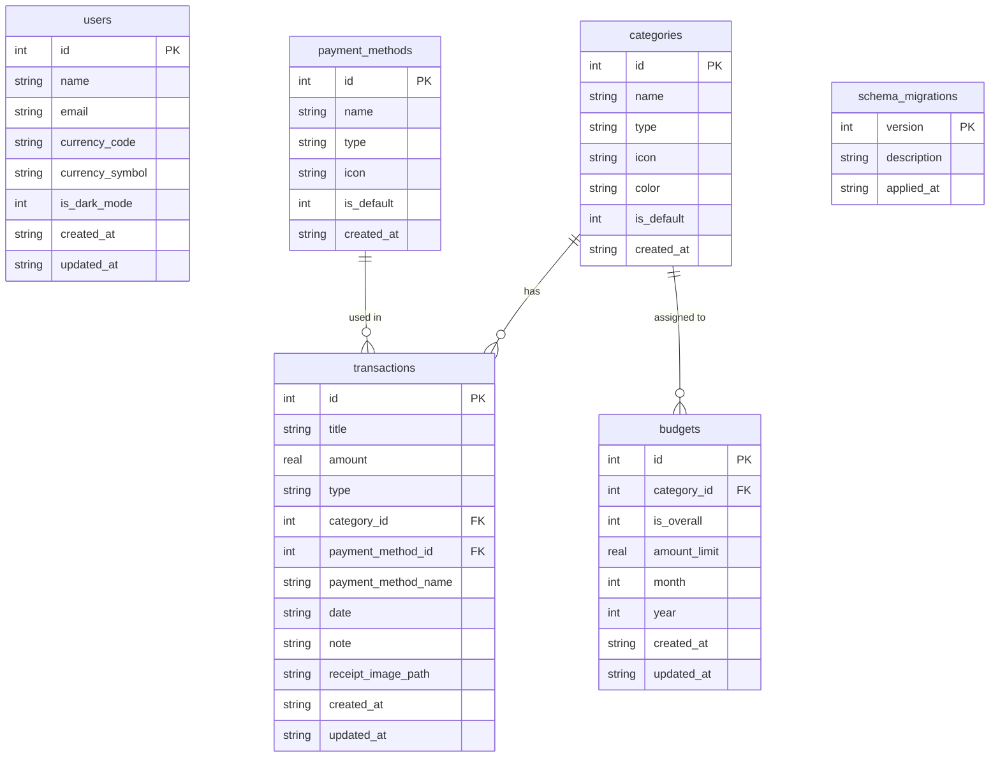

# KharchMate Architecture & Design Document

KharchMate is an offline-first, modern personal finance and expense tracking application built with Flutter. This document specifies the architectural patterns, directory structure, routing, design system tokens, database persistence layer, domain entities, feature modules, and test architecture implemented in the project.

---

## 1. Architectural Overview

KharchMate adopts a **Layered & Feature-Modular Architecture** designed for high maintainability, testability, and clean separation of concerns:

- **Declarative Navigation**: Centralized route definitions and navigation handling powered by `go_router`.
- **Centralized Design System**: Dedicated design tokens (`AppColors`, `AppDimens`, `AppFonts`, `AppIcons`) and Material 3 theme configurations (`AppThemes`, `CustomTextStyle`).
- **Dependency Injection**: Service locator pattern via `lib/di/service_locator.dart` (GetIt) for decoupling business logic, SQLite services, and DAOs from the UI layer.
- **Offline-First Persistence**: Fully local relational persistence via SQLite (`sqflite`), featuring versioned schema migrations (`MigrationRunner`) and modular Data Access Objects (DAOs).
- **Interactive Onboarding**: Tutorial walkthrough carousel with auto-advancing slides and a profile setup screen capturing the user's **Full Name** and **Email Address** with instant validation.
- **Reusable Component Library**: Standardized custom widgets (`AppTextButton`, `AppTextFormField`, `AppLoader`, `CommonListView`, `MonthYearPickerSheet`) enforcing uniform UI and interactions across features.

---

## 2. System Flow & Component Interaction

```mermaid
flowchart TD
    subgraph Navigation
        Router[AppRouter - GoRouter]
        Routes[AppRoutes Enum & Paths]
    end

    subgraph Presentation & UI Layer
        Splash[Splash Module: lib/ui/splash]
        Onboarding[Onboarding Module: Welcome & UserName Screens]
        Dashboard[Dashboard Module: Financial Summaries & Month Picker]
        Transactions[Transactions Module: Add, Edit, List & Details]
        Categories[Categories Module: List & Add Category]
        Settings[Settings Module: Profile, Currency, Dark Mode, Logout]
        Widgets[Reusable Components: lib/widgets/*]
    end

    subgraph Core Resources & Tokens
        Resources[AppColors, AppDimens, AppFonts, AppIcons]
        Utils[ValidationHelper, Constants, Enums]
    end

    subgraph Service & Persistence Layer
        DI[Service Locator: lib/di/service_locator.dart]
        DBService[DatabaseService: Unified SQLite API]
        DAOs[DAOs: UserDao, CategoryDao, TransactionDao, BudgetDao, PaymentMethodDao]
        Migrations[MigrationRunner & MigrationV1InitialSchema]
        AppDb[AppDatabase: SQLite Engine]
        SecureStore[SecureStorageService: Encrypted Storage]
    end

    Router -->|Resolves Route| Routes
    Routes -->|Renders| Splash
    Routes -->|Renders| Onboarding
    Routes -->|Renders| Dashboard
    Routes -->|Renders| Transactions
    Routes -->|Renders| Categories
    Routes -->|Renders| Settings

    Onboarding -->|Validates Input| Utils
    Transactions -->|Validates Input| Utils
    Presentation & UI Layer -->|Uses| Widgets
    Widgets -->|Styled By| Resources

    Onboarding -->|Saves Profile| DBService
    Dashboard -->|Loads Monthly Data| DBService
    Transactions -->|CRUD Transactions| DBService
    Categories -->|CRUD Categories| DBService
    Settings -->|Loads/Updates Profile & Preferences| DBService

    DBService -->|Delegates to| DAOs
    DAOs -->|Executes Queries| AppDb
    AppDb -->|Runs Versioned Migrations| Migrations
    DI -->|Provides Singleton| DBService
    DI -->|Provides Singleton| AppDb
    DI -->|Provides Singleton| SecureStore
```

---

## 3. Project Directory Structure

```
KharchMate/
├── assets/
│   ├── fonts/                         # Custom Poppins font family
│   │   ├── Poppins-Thin.ttf           # Weight 100
│   │   ├── Poppins-Light.ttf          # Weight 300
│   │   ├── Poppins-Regular.ttf        # Weight 400
│   │   ├── Poppins-Medium.ttf         # Weight 500
│   │   ├── Poppins-SemiBold.ttf       # Weight 600
│   │   └── Poppins-Bold.ttf           # Weight 700
│   └── images/                        # Visual graphic assets & app icons
│
├── lib/
│   ├── main.dart                      # Application bootstrap & entry point
│   │
│   ├── database/                      # SQLite Persistence Engine
│   │   ├── app_database.dart          # Database initialization & migration executor
│   │   ├── database_constants.dart    # Table & column name constants
│   │   ├── daos/                      # Data Access Objects
│   │   │   ├── budget_dao.dart        # Budgets table queries & limit checking
│   │   │   ├── category_dao.dart      # Category queries & custom category inserts
│   │   │   ├── payment_method_dao.dart# Payment methods queries & seeding
│   │   │   ├── transaction_dao.dart   # Transaction CRUD, monthly summaries & trends
│   │   │   └── user_dao.dart          # User profile persistence (name, email, dark mode)
│   │   └── migrations/                # Versioned Database Migrations
│   │       ├── database_migration.dart# Abstract migration base class & MigrationRunner
│   │       └── migration_v1.dart      # V1 schema & default categories/payment methods
│   │
│   ├── di/                            # Dependency Injection
│   │   └── service_locator.dart       # Service locator registrations (GetIt)
│   │
│   ├── enum/                          # Domain Enumerations
│   │   ├── payment_mode.dart          # PaymentMode (upi, card, bank, cash)
│   │   └── payment_type.dart          # PaymentType (credit, debit)
│   │
│   ├── helper/                        # Utility Helpers
│   │   └── validation_helper.dart     # Validation rules (email regex, non-empty)
│   │
│   ├── models/                        # Immutable Domain Entities
│   │   ├── budget_item.dart           # BudgetItem model
│   │   ├── category.dart              # CategoryModel & CategoryType enum
│   │   ├── financial_summary.dart     # FinancialSummary, CategorySpending & MonthlyTrend
│   │   ├── payment_method.dart        # PaymentMethodModel & PaymentMethodType enum
│   │   ├── transaction_item.dart      # TransactionItem model & TransactionType enum
│   │   └── user_profile.dart          # UserProfile model (name, email, currency, initials)
│   │
│   ├── resources/                     # Design Tokens & Constants
│   │   ├── app_colors.dart            # Palettes, gradients, finance & category colors
│   │   ├── app_dimension.dart         # Dimensional tokens (dimen0 to dimen210)
│   │   ├── app_font.dart              # Font family identifiers (Poppins)
│   │   ├── app_icons.dart             # Static asset image & icon paths
│   │   └── resources.dart             # Barrel export file
│   │
│   ├── router/                        # Routing & Navigation
│   │   ├── app_router.dart            # GoRouter configuration & route bindings
│   │   └── app_routes.dart            # AppRoutes enum, path & name extensions
│   │
│   ├── services/                      # Persistent Services
│   │   ├── database_service.dart      # Unified SQLite database service API
│   │   └── secure_storage_service.dart# Encrypted key-value persistence
│   │
│   ├── theme/                         # Theming & Typography
│   │   ├── custom_text_style.dart     # Material TextTheme styling with Poppins
│   │   └── themes.dart                # AppThemes (Material 3, AppBar, inputs)
│   │
│   ├── ui/                            # Feature Modules & Presentation Screens
│   │   ├── categories/                # Categories feature
│   │   │   └── presentation/
│   │   │       ├── add_category_screen.dart # Create custom expense/income category
│   │   │       └── categories_screen.dart   # View categories list by type
│   │   ├── dashboard/                 # Financial dashboard feature
│   │   │   └── presentation/
│   │   │       └── dashboard_screen.dart    # Balance card, recent items, summaries
│   │   ├── onboarding/                # User onboarding feature
│   │   │   └── presentation/
│   │   │       ├── user_name_screen.dart    # Full Name and Email ID entry
│   │   │       └── welcome_screen.dart      # 3-step tutorial walkthrough
│   │   ├── settings/                  # User settings feature
│   │   │   └── presentation/
│   │   │       └── settings_screen.dart     # Profile card, currencies, dark mode, logout
│   │   ├── splash/                    # Splash feature
│   │   │   └── presentation/
│   │   │       └── splash_screen.dart       # Splash screen with logo animation
│   │   └── transaction/               # Transactions feature
│   │       └── presentation/
│   │           ├── add_transaction_screen.dart    # Record or edit transaction
│   │           ├── transaction_details_screen.dart# Transaction detail & delete view
│   │           └── transactions_screen.dart       # Full transaction history list
│   │
│   ├── utility/                       # Global Constants & Keys
│   │   └── constant.dart              # StorageKey and StringKey constants
│   │
│   └── widgets/                       # Reusable UI Components
│       ├── app_loader.dart            # Loading overlay with CircularProgressIndicator
│       ├── app_text_button.dart       # Gradient-styled action buttons
│       ├── app_textformfield.dart     # Form input fields with validation and icons
│       ├── common_listview.dart       # Generalized list views with empty states
│       └── month_year_picker_sheet.dart# Bottom sheet for month-year navigation
│
├── test/                              # Automated Unit & Widget Test Suite
│   ├── add_transaction_test.dart      # Form inputs, type toggle & insert tests
│   ├── categories_test.dart           # Predefined categories & custom category creation
│   ├── database_test.dart             # Migrations, DAOs, budget limits, summaries
│   ├── settings_test.dart             # Profile header, currency picker, dark mode
│   ├── transactions_test.dart         # Listing, filtering, details, deletion
│   ├── user_name_screen_test.dart     # Name and email input validation tests
│   ├── welcome_screen_test.dart       # Carousel timer auto-advance tests
│   └── widget_test.dart               # Sanity test
│
├── pubspec.yaml                       # Dependencies, fonts & asset bindings
├── README.md                          # Project documentation & quick start
└── ARCHITECTURE.md                    # Technical architecture document
```

---

## 4. Routing & Navigation Architecture (`lib/router/`)

KharchMate uses **`go_router`** for declarative routing and deep-linking support.

### Complete Route Specifications (`app_routes.dart`)

| Enum Case | Path | Name | Screen / Purpose |
| :--- | :--- | :--- | :--- |
| `AppRoutes.root` | `/` | `Root` | Initial route redirection |
| `AppRoutes.splash` | `/splash` | `Splash` | Splash screen with logo animation and onboarding check |
| `AppRoutes.welcome` | `/welcome` | `Welcome` | 3-slide introductory walkthrough carousel |
| `AppRoutes.userName` | `/user-name` | `UserName` | Profile personalization (Full Name and Email Address) |
| `AppRoutes.dashboard` | `/dashboard` | `Dashboard` | Financial summary cards, balance overview & recent list |
| `AppRoutes.transaction` | `/transaction` | `Transaction` | Searchable and filterable transaction history list |
| `AppRoutes.addTransaction` | `/add-transaction` | `AddTransaction` | Record a new expense or income transaction |
| `AppRoutes.transactionDetails` | `/transaction-details` | `TransactionDetails` | Detailed view for selected transaction with delete action |
| `AppRoutes.report` | `/report` | `Report` | Spending analytics, monthly trends & visual breakdown |
| `AppRoutes.budget` | `/budget` | `Budget` | Overall and category budget planning & limit alerts |
| `AppRoutes.settings` | `/settings` | `Settings` | User profile, currency picker, dark mode, logout |
| `AppRoutes.categories` | `/categories` | `Categories` | Expense & Income category list with default badges |
| `AppRoutes.addCategory` | `/add-category` | `AddCategory` | Custom category creation with icon and color selector |

---

## 5. Persistence Layer & Database Architecture (`lib/database/`)

### Embedded SQLite Engine (`AppDatabase`)
- KharchMate stores all financial records locally in an SQLite database (`kharch_mate.db`) using `sqflite` on mobile and `sqflite_common_ffi` during unit and widget testing.
- Single unified entry point orchestrated via `AppDatabase` and exposed to the app through `DatabaseService`.

### Database Tables & Schema



### Versioned Migration Runner (`MigrationRunner`)
Schema migrations are handled by `MigrationRunner`:
- Implements version checking against the `schema_migrations` table.
- Executes `up()` migrations sequentially in an atomic SQLite transaction.
- Facilitates rolling back changes via `down()` when executing database resets.
- **Migration V1** (`migration_v1.dart`):
  - Creates tables: `users`, `categories`, `payment_methods`, `transactions`, `budgets`, and `schema_migrations`.
  - Creates indexes on `transactions(date)`, `transactions(type)`, `transactions(category_id)`, and `budgets(month, year)`.
  - Seeds default predefined categories:
    - Expense: Rent (`#26A69A`), Food (`#FF9800`), Transport (`#42A5F5`), Shopping (`#7E57C2`)
    - Income: Salary (`#1A6C45`), Bonus (`#E91E63`)
  - Seeds default payment methods: Cash, HDFC Bank, UPI, Credit Card, Debit Card.

---

## 6. Data Access Objects (DAOs) (`lib/database/daos/`)

1. **`UserDao`**:
   - `getUserProfile()`: Retrieves user record.
   - `hasUser()`: Checks if onboarding profile setup has been completed.
   - `saveUserProfile(UserProfile)`: Creates or updates profile.
   - `saveUserName(String name, {String? email})`: Convenience onboarding method to persist user's Full Name and Email Address.
   - `updateDarkMode(bool)`: Updates dark theme preference.
   - `deleteUser()`: Clears user data on logout.
2. **`CategoryDao`**:
   - `getAllCategories()` / `getCategoriesByType(CategoryType)`: Category queries.
   - `insertCategory(CategoryModel)` / `updateCategory(CategoryModel)`: Custom category management.
   - `deleteCategory(int id)`: Safe deletion preventing removal of predefined categories.
3. **`PaymentMethodDao`**:
   - `getAll()` / `getById(int id)`: Payment method queries.
   - `insert(PaymentMethodModel)`: Adds new payment options.
4. **`TransactionDao`**:
   - `insertTransaction(TransactionItem)` / `updateTransaction(TransactionItem)`: Transaction storage with joined category details.
   - `deleteTransaction(int id)`: Deletes selected transaction record.
   - `getRecentTransactions({int limit = 5})`: Fetches latest entries.
   - `getTransactions(...)`: Complex filtering by type, search query, month, year, and category.
   - `getMonthlySummary(int month, int year)`: Computes Total Income, Total Expense, Net Balance, and category spending breakdown.
   - `getMonthlyTrends(int year, {int count = 6})`: Computes multi-month trend metrics for analytics.
5. **`BudgetDao`**:
   - `getOverallBudget(month, year)` / `setOverallBudget(...)`: Monthly overall limit management.
   - `getCategoryBudgets(month, year)` / `setCategoryBudget(...)`: Category-specific limits.
   - `getBudgetAlert(month, year)`: Real-time calculation alerting if spending reaches 80% or exceeds 100% of limits.

---

## 7. Design System & Design Tokens (`lib/resources/` & `lib/theme/`)

The design system enforces visual consistency, accessibility, and brand identity:

### Color Palette (`app_colors.dart`)
- **Brand Colors**:
  - `primary`: `#FF7A00` (Warm Orange)
  - `primaryDark`: `#E65100` (Dark Saffron)
  - `primaryLight`: `#FFB74D`
  - `primaryBackground`: `#FFF3E0`
  - `linerGradient`: Linear gradient from `#E65100` to `#FF7A00` to `#FF9800`
- **Finance Indicators**:
  - `income`: Deep Green (`#1A6C45`) | `incomeLight`: `#E8F5EE`
  - `expense`: Bright Coral Red (`#F44336`) | `expenseLight`: `#FFEBEE`
  - `savings`: Teal (`#00897B`) | `savingsLight`: `#E0F2F1`
- **Category Colors**:
  - `food`: `#FF9800` | `shopping`: `#7E57C2` | `transport`: `#42A5F5`
  - `rent`: `#26A69A` | `bills`: `#EF5350` | `other`: `#66BB6A`
- **Typography & Neutral Colors**:
  - `textPrimary`: `#05335B`
  - `textSecondary`: `#45627A`
  - `textHint`: `#78909C`
  - `borderColor`: `#E2E8EC` | `dividerColor`: `#F0F2F3`

### Dimension Tokens (`app_dimension.dart`)
- Spacing and sizing tokens from `dimen0` to `dimen210` ensuring consistent padding, margins, and card radius across phone and tablet viewports.

### Typography System (`app_font.dart` & `custom_text_style.dart`)
KharchMate utilizes **Poppins** across all typography styles:
- `displayLarge` (57sp, Bold, w700)
- `headlineLarge` (32sp, SemiBold, w600)
- `titleLarge` (22sp, SemiBold, w600)
- `bodyLarge` (16sp, Regular, w400)
- `labelLarge` (14sp, Medium, w500)

---

## 8. Feature Modules & UI Architecture (`lib/ui/`)

### 1. Splash Module (`ui/splash/`)
- Checks if a user profile exists via `DatabaseService.hasUser()`.
- Routes to `AppRoutes.dashboard` if registered, or `AppRoutes.welcome` for new users.

### 2. Onboarding Module (`ui/onboarding/`)
- **`WelcomeScreen`**: 3-step interactive tutorial showcasing core value propositions ("Take Control", "Smart Budgets", "Visual Reports"). Auto-advances every 3.5 seconds with dot indicators.
- **`UserNameScreen`**: Personalization screen capturing **Full Name** and **Email Address**.
  - Validates full name (min 2 characters, non-empty).
  - Validates email address format via `ValidationHelper.email` regex (`^[a-zA-Z0-9._%+-]+@[a-zA-Z0-9.-]+\.[a-zA-Z]{2,}$`).
  - Persists profile using `DatabaseService.saveUserName(name, email: email)`.

### 3. Dashboard Module (`ui/dashboard/`)
- Displays greeting with user initials and name.
- Summary balance card highlighting Total Balance, Total Income, and Total Expense.
- Dynamic Month-Year selector opening `MonthYearPickerSheet` to filter summaries across any selected month and year.
- Quick action button for logging transactions and category breakdown progress indicators.

### 4. Transactions Module (`ui/transaction/`)
- **`TransactionsScreen`**: Filterable list with tab toggles (All, Expense, Income) and search bar.
- **`AddTransactionScreen`**: Form supporting amount, type toggle (Expense vs. Income), category selector with visual icons, payment mode dropdown, date picker, and optional notes.
- **`TransactionDetailsScreen`**: Clean presentation of single transaction with category badges, date, payment method, notes, and a delete action with confirmation modal.

### 5. Categories Module (`ui/categories/`)
- **`CategoriesScreen`**: Tabbed view separating Expense and Income categories, displaying icon, color, and "Default" tag.
- **`AddCategoryScreen`**: Allows users to input category title, select category type (Expense or Income), choose an icon from financial icon presets, and pick a custom hex color badge.

### 6. Settings Module (`ui/settings/`)
- **Profile Card**: Displays user avatar initials, full name, and email address.
- **Currency Picker**: Bottom sheet allowing users to switch active currency (INR, USD, EUR, GBP, AED, CAD, AUD, JPY).
- **Categories Shortcut**: Direct push navigation to `CategoriesScreen`.
- **Preferences & Toggles**: Dark mode switch, notifications dialog, privacy & security info.
- **Logout / Reset**: Confirmation modal that clears user session via `DatabaseService.deleteUser()` and navigates back to onboarding.

---

## 9. Testing Strategy & Test Coverage (`test/`)

KharchMate maintains a comprehensive automated test suite verifying database operations, state transitions, and UI flows:

| Test File | Scope / Verified Behavior |
| :--- | :--- |
| `database_test.dart` | SQLite initialization, schema creation, migration runner, DAOs (`UserDao`, `CategoryDao`, `TransactionDao`, `BudgetDao`), summaries & alert limits |
| `user_name_screen_test.dart` | Onboarding field rendering, empty input validation, email regex validation (`ValidationHelper.email`) |
| `welcome_screen_test.dart` | 3 tutorial slides, timer auto-advancement, and dot indicator navigation |
| `transactions_test.dart` | Transactions listing, tab switching, search filter, details view, and deletion |
| `add_transaction_test.dart` | Form validation, amount and category selection, PaymentMode enum verification |
| `categories_test.dart` | Default category seeding, expense/income tabs, custom category addition |
| `settings_test.dart` | Profile card with user name/email, 8 settings options, currency selector sheet, dark mode toggle |

Run tests anytime with:
```bash
flutter test
```
