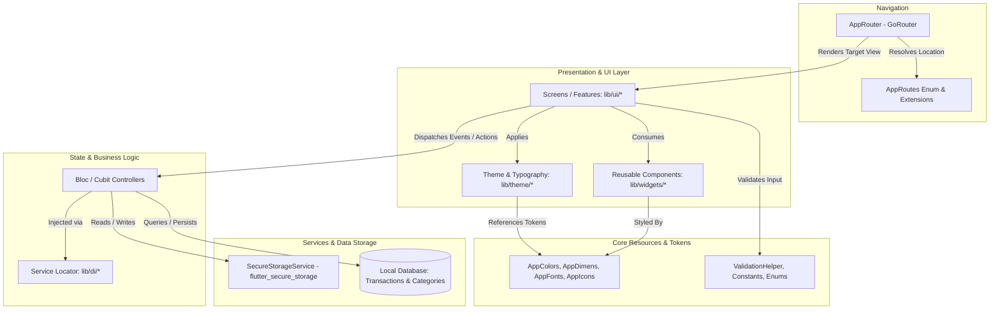

# KharchMate Architecture & Design Document

KharchMate is an offline-first, modern personal finance and expense tracking application built with Flutter. This document specifies the architectural patterns, directory structure, routing, design system tokens, state management, and persistence layer as implemented in the project.

---

## 1. Architectural Overview

KharchMate adopts a **Layered & Feature-Modular Architecture** designed for maintainability, clean separation of concerns, and ease of scaling:

- **Declarative Navigation**: Centralized route definitions and navigation handling powered by `go_router`.
- **Centralized Design System**: Dedicated design tokens (`AppColors`, `AppDimens`, `AppFonts`, `AppIcons`) and Material 3 theme configurations (`AppThemes`, `CustomTextStyle`).
- **Dependency Injection**: Service locator pattern via `lib/di/service_locator.dart` for decoupling business logic, storage, and repositories from the UI layer.
- **Secure & Offline-First Persistence**: Device-encrypted key-value storage via `SecureStorageService` (`flutter_secure_storage`) paired with local database persistence for transactions.
- **Reusable Component Library**: Standardized custom widgets (`AppTextButton`, `AppTextFormField`, `AppLoader`, `CommonListView`) enforcing uniform UI across features.

---

## 2. System Flow & Component Interaction



---

## 3. Project Directory Structure

```
KharchMate/
├── assets/
│   ├── fonts/                         # Custom Poppins font family
│   │   ├── Poppins-Thin.ttf           # Weight 100
│   │   ├── Poppins-Light.ttf          # Weight 300
│   │   ├── Poppins-Regular.ttf        # Weight 400
│   │   ├── Poppins-Medium.ttf         # Weight 500
│   │   ├── Poppins-SemiBold.ttf       # Weight 600
│   │   └── Poppins-Bold.ttf           # Weight 700
│   └── images/                        # Visual graphic assets
│       ├── splash_logo.png            # KharchMate brand splash mark
│       └── tutorial.png               # Onboarding and walkthrough graphics
│
├── lib/
│   ├── main.dart                      # Application bootstrap & entry point
│   │
│   ├── di/                            # Dependency Injection
│   │   └── service_locator.dart       # Service locator registrations
│   │
│   ├── enum/                          # Domain Enumerations
│   │   ├── payment_type.dart          # PaymentType (credit, debit)
│   │   └── payment_mode.dart          # PaymentMode (upi, card, bank, cash)
│   │
│   ├── helper/                        # Helper Utilities
│   │   └── validation_helper.dart     # Form & field validation rules (email, blank checks)
│   │
│   ├── resources/                     # Design Tokens & Resource Exports
│   │   ├── app_colors.dart            # Palettes, gradients, finance & category colors
│   │   ├── app_dimension.dart         # Dimensional tokens (dimen0 to dimen210)
│   │   ├── app_font.dart              # Font family identifiers (Poppins)
│   │   ├── app_icons.dart             # Static asset image & icon path constants
│   │   └── resources.dart             # Barrel export file for all resources
│   │
│   ├── router/                        # Routing & Navigation
│   │   ├── app_router.dart            # GoRouter configuration & route bindings
│   │   └── app_routes.dart            # AppRoutes enum, path & name extensions
│   │
│   ├── services/                      # Application Services
│   │   └── secure_storage_service.dart# Encrypted key-value persistence
│   │
│   ├── theme/                         # Theming & Typography
│   │   ├── custom_text_style.dart     # Material TextTheme styling with Poppins
│   │   └── themes.dart                # AppThemes.coreTheme (Material 3, AppBar, inputs)
│   │
│   ├── ui/                            # Feature Screens & Views
│   │   └── splash/                    # Splash Feature Module
│   │       └── presentation/
│   │           └── splash_screen.dart # Splash screen view
│   │   # Planned Modules:
│   │   # ├── dashboard/               # Income/Expense summaries, balance cards
│   │   # ├── transactions/            # Add, edit, list & details
│   │   # ├── report/                  # Analytics & visual charts
│   │   # ├── budget/                  # Budget planning & limits
│   │   # └── settings/                # Currency, security, preferences
│   │
│   ├── utility/                       # Global Constants & Keys
│   │   └── constant.dart              # StorageKey and StringKey constants
│   │
│   └── widgets/                       # Reusable UI Components
│       ├── app_loader.dart            # Loading indicators
│       ├── app_text_button.dart       # Gradient-styled action buttons
│       ├── app_textformfield.dart     # Form text input fields
│       └── common_listview.dart       # Reusable list views with empty states
│
├── pubspec.yaml                       # Dependencies, fonts & asset bindings
├── README.md                          # Project documentation & setup instructions
└── ARCHITECTURE.md                    # Technical architecture document
```

---

## 4. Routing & Navigation Architecture (`lib/router/`)

KharchMate uses **`go_router`** for declarative and deep-link-ready routing.

### Route Enum & Paths (`app_routes.dart`)
| Enum Case | Path | Name | Description |
| :--- | :--- | :--- | :--- |
| `AppRoutes.root` | `/` | `Root` | Root initial redirection |
| `AppRoutes.splash` | `/splash` | `Splash` | Splash screen with logo animation |
| `AppRoutes.dashboard` | `/dashboard` | `Dashboard` | Main financial dashboard & summaries |
| `AppRoutes.transation` | `/transation` | `Transaction` | Transaction history list |
| `AppRoutes.addTransaction`| `/addTransaction` | `AddTransaction` | Record income or expense |
| `AppRoutes.transctionDetails` | `/transctionDetails` | `TransactionDetails` | Detailed view for selected transaction |
| `AppRoutes.report` | `/report` | `Report` | Analytics, trends, and charts |
| `AppRoutes.budget` | `/budget` | `Budget` | Budget tracking & limit controls |
| `AppRoutes.settings` | `/setting` | `Setting` | Settings, currencies, and backups |

### Router Configuration (`app_router.dart`)
- **Root Navigator Key**: `rootNavigatorKey = GlobalKey<NavigatorState>()` allows navigation from service or business layers without context when necessary.
- **Initial Location**: Starts on `AppRoutes.splash.path`.
- **Helper Methods**: `AppRouter.pop()` provides safe stack popping using current tab context.

---

## 5. Design System & Design Tokens (`lib/resources/` & `lib/theme/`)

The design system enforces visual consistency, accessibility, and brand identity:

### Color Palette (`app_colors.dart`)
- **Brand Colors**:
  - `primary`: `#F57C00` (Saffron Orange)
  - `primaryDark`: `#E65100` (Dark Saffron)
  - `primaryLight`: `#FFB74D`
  - `primaryBackground`: `#FFF3E0`
  - `linerGradient`: Linear gradient from Dark Saffron (`#E65100`) to Saffron (`#F57C00`) to Light Orange (`#FF9800`)
- **Finance Indicators**:
  - `income`: Deep Green (`#1A6C45`) | `incomeLight`: `#E8F5EE`
  - `expense`: Bright Coral Red (`#F44336`) | `expenseLight`: `#FFEBEE`
  - `savings`: Teal (`#00897B`) | `savingsLight`: `#E0F2F1`
- **Category Colors**:
  - `food`: `#FF9800` | `shopping`: `#7E57C2` | `transport`: `#42A5F5`
  - `rent`: `#26A69A` | `bills`: `#EF5350` | `other`: `#66BB6A`
- **Typography & Neutral Colors**:
  - `textPrimary`: `#05335B`
  - `textSecondary`: `#45627A`
  - `textHint`: `#78909C`
  - `borderColor`: `#E2E8EC` | `dividerColor`: `#F0F2F3`

### Dimension Tokens (`app_dimension.dart`)
Centralized spacing via `AppDimens`:
- Standard text sizes: `defaultNormalTextSize` (12dp), `defaultSemiboldTextSize` (16dp).
- Scaled dimension constants from `dimen0` up to `dimen210` for uniform margins, paddings, and card radius.

### Typography System (`app_font.dart` & `custom_text_style.dart`)
KharchMate utilizes **Poppins** across all text styles:
- `displayLarge` (57sp, Bold, w700)
- `headlineLarge` (32sp, SemiBold, w600)
- `titleLarge` (22sp, SemiBold, w600)
- `bodyLarge` (16sp, Regular, w400)
- `labelLarge` (14sp, Medium, w500)

### Theme Configuration (`themes.dart`)
- Material 3 enabled (`useMaterial3: true`).
- Custom `AppBarTheme` with clean 0 elevation and `primaryBackground`.
- Custom `TextSelectionThemeData` tinted with primary saffron orange.

---

## 6. Shared Reusable Widgets (`lib/widgets/`)

Reusable widgets maintain DRY UI components and encapsulate standard styling:
- **`AppTextButton`**: Primary button component featuring the brand's linear gradient (`AppColors.linerGradient`), rounded corners, custom padding, and disabled states.
- **`AppTextFormField`**: Custom text input supporting hint text, validation states, and icons.
- **`AppLoader`**: Standard loading indicator styled with the primary orange palette.
- **`CommonListView`**: Generalized list view supporting scroll handling and empty state display.

---

## 7. Persistence & Security Layer (`lib/services/`)

### Secure Local Storage (`secure_storage_service.dart`)
- Powered by `flutter_secure_storage` to encrypt sensitive user settings, tokens, or biometric preferences on Keychain (iOS) and Keystore (Android).
- Supports type-safe helpers: `writeSecureData()`, `getString()`, `getInt()`, `getBool()`, `getDouble()`, and `clearStorage()`.

### Relational Transaction Database (Planned)
- For storing transaction records, category definitions, and monthly balances offline, KharchMate pairs `SecureStorageService` with a local database engine (`sqflite` or `drift`), enabling fast indexing and aggregation queries.

---

## 8. Domain Entities & Enums (`lib/enum/`)

Domain rules and types are strongly typed using Dart enums:
- **`PaymentType`**:
  - `credit`: Inflow of funds (salary, returns, dividends).
  - `debit`: Outflow of funds (expenses, payments).
- **`PaymentMode`**:
  - `upi`: UPI / digital wallet transactions.
  - `card`: Credit or debit card payments.
  - `bank`: Direct bank transfer or net banking.
  - `cash`: Physical currency payments.

---

## 9. State Management & Dependency Injection (`lib/di/`)

- **Service Locator**: Configured in `lib/di/service_locator.dart` (using GetIt or direct registration) to provide singleton instances of `SecureStorageService`, database clients, and repositories.
- **State Management**: Uses Bloc/Cubit pattern (`flutter_bloc`) to manage feature-specific presentation state (such as `LoginCubit`, `TransactionCubit`, `DashboardCubit`), decoupling business logic from UI widgets.

---

## 10. Development Standards & Conventions

1. **Imports**: Prefer barrel files (e.g., `import 'package:kharch_mate/resources/resources.dart';`) to keep import headers concise.
2. **Design Tokens**: Never hardcode colors or dimensions; reference `AppColors` and `AppDimens`.
3. **Strings & Localization**: Use `StringKey` constants from `lib/utility/constant.dart` instead of raw string literals in UI widgets.
4. **Validation**: Use `ValidationHelper` for form input checks.
5. **Linting**: Code must adhere to `analysis_options.yaml` (Flutter lints).
