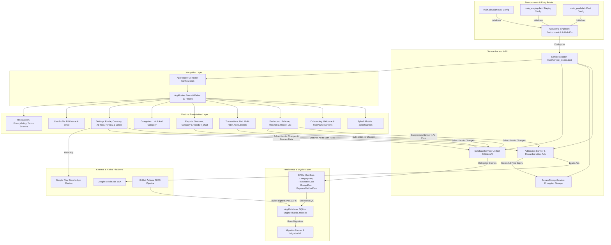
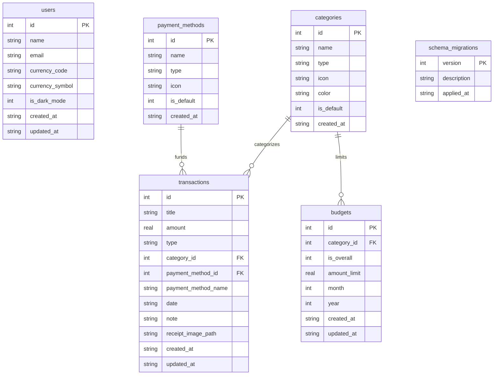
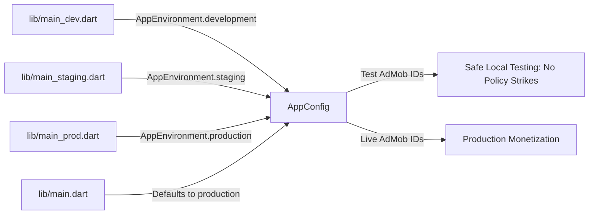
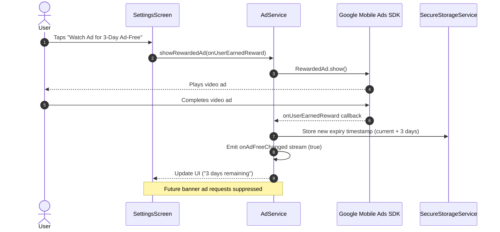
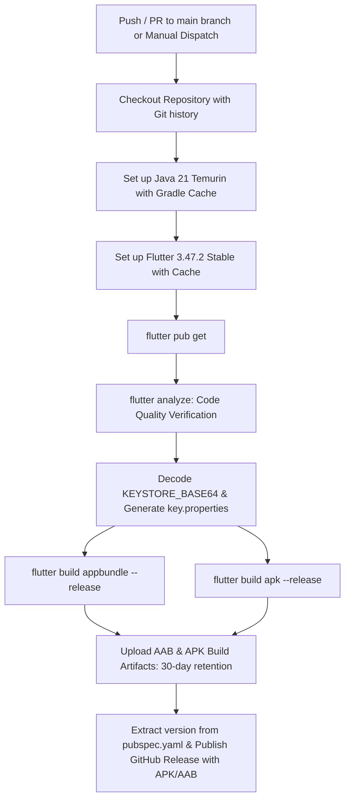

# KharchMate Architecture & Design Document

KharchMate is an offline-first, modern personal finance and expense tracking application built with Flutter. This document specifies the architectural patterns, directory structure, routing, design system tokens, database persistence layer, multi-environment configuration, monetization and reward engine, analytics architecture, security compliance, and CI/CD release engineering implemented in the project.

---

## 1. Architectural Overview

KharchMate adopts a **Layered & Feature-Modular Architecture** engineered for testability, offline reliability, modularity, and clean separation of concerns:

- **Declarative Navigation**: Centralized route definitions and navigation handling powered by `go_router` (17 distinct routes) with bottom navigation bar coordination and center-docked action triggers.
- **Multi-Environment Configuration**: Environment isolation across **Development**, **Staging**, and **Production** managed via `AppConfig` and separate entry points (`main_dev.dart`, `main_staging.dart`, `main_prod.dart`, `main.dart`).
- **Dependency Injection**: Service locator pattern via `lib/di/service_locator.dart` (GetIt) providing singletons and lazy singletons for database services, secure storage, ad services, and configuration.
- **Offline-First SQLite Persistence**: Fully local relational persistence via `sqflite`, featuring atomic schema migrations (`MigrationRunner`), modular Data Access Objects (DAOs), and reactive streams for instant UI synchronization.
- **Monetization & Ad-Free Reward System**: Google AdMob integration (`google_mobile_ads`) with adaptive banners and a **3-Day Ad-Free Reward Pass** unlocked by watching rewarded video ads, persisted in encrypted storage (`flutter_secure_storage`).
- **Visual Analytics & Reporting Engine**: Data visualization powered by `fl_chart`, featuring interactive spending pie charts, category breakdowns, and 6-month comparative income vs expense trends.
- **Advanced Filtering & Search**: Multi-dimensional filtering engine allowing queries by transaction type, month-year, single date, category, and debounced text search with client-side sorting.
- **Privacy & Google Play Compliance**: 100% offline data retention with built-in "Delete My Data" atomic database wipe, paired with hosted web compliance portals (`docs/`).
- **Automated CI/CD & Release Pipeline**: GitHub Actions workflow orchestrating code analysis, release keystore injection, and automated builds of signed Android App Bundles (`.aab`) and APKs (`.apk`) with automated GitHub Releases.

---

## 2. System Flow & Component Interaction


```mermaid
flowchart TD
    subgraph Environments & Entry Points
        MainDev[main_dev.dart: Dev Config]
        MainStaging[main_staging.dart: Staging Config]
        MainProd[main_prod.dart: Prod Config]
        AppCfg[AppConfig Singleton: Environment & AdMob IDs]
    end

    subgraph Service Locator & DI
        DI[Service Locator: lib/di/service_locator.dart]
        AdSvc[AdService: Banner & Rewarded Video Ads]
        SecStore[SecureStorageService: Encrypted Storage]
        DBService[DatabaseService: Unified SQLite API]
    end

    subgraph Navigation Layer
        Router[AppRouter: GoRouter Configuration]
        Routes[AppRoutes Enum & Paths: 17 Routes]
    end

    subgraph Feature Presentation Layer
        Splash[Splash Module: SplashScreen]
        Onboarding[Onboarding: Welcome & UserName Screens]
        Dashboard[Dashboard: Balance, PieChart & Recent List]
        Transactions[Transactions: List, Multi-Filter, Add & Details]
        Reports[Reports: Overview, Category & Trends fl_chart]
        Categories[Categories: List & Add Category]
        Settings[Settings: Profile, Currency, Ad-Free, Review & Delete]
        ProfileScreen[UserProfile: Edit Name & Email]
        LegalScreens[HelpSupport, PrivacyPolicy, Terms Screens]
    end

    subgraph Persistence & SQLite Layer
        AppDb[AppDatabase: SQLite Engine kharch_mate.db]
        Migrations[MigrationRunner & MigrationV1]
        DAOs[DAOs: UserDao, CategoryDao, TransactionDao, BudgetDao, PaymentMethodDao]
    end

    subgraph External & Native Platforms
        AdMobSDK[Google Mobile Ads SDK]
        PlayStore[Google Play Store In-App Review]
        CI[GitHub Actions CI/CD Pipeline]
    end

    MainDev -->|Initializes| AppCfg
    MainStaging -->|Initializes| AppCfg
    MainProd -->|Initializes| AppCfg
    AppCfg -->|Configures| DI

    DI --> AdSvc
    DI --> SecStore
    DI --> DBService
    DI --> Router

    Router --> Routes
    Routes --> Splash
    Routes --> Onboarding
    Routes --> Dashboard
    Routes --> Transactions
    Routes --> Reports
    Routes --> Categories
    Routes --> Settings
    Routes --> ProfileScreen
    Routes --> LegalScreens

    AdSvc -->|Loads Ads| AdMobSDK
    AdSvc -->|Stores Ad-Free Expiry| SecStore
    Settings -->|Watches Ad to Earn Pass| AdSvc
    Dashboard -->|Suppresses Banner if Ad-Free| AdSvc

    DBService -->|Delegates Queries| DAOs
    DAOs -->|Executes SQL| AppDb
    AppDb -->|Runs Migrations| Migrations

    Dashboard -->|Subscribes to Changes| DBService
    Transactions -->|Subscribes to Changes| DBService
    Reports -->|Subscribes to Changes| DBService
    Settings -->|Subscribes to Changes & Deletes Data| DBService

    Settings -->|Rate App| PlayStore
    CI -->|Builds Signed AAB & APK| AppDb
```

---

## 3. Project Directory Structure

```
KharchMate/
├── .github/
│   └── workflows/
│       └── deploy.yml                 # GitHub Actions CI/CD workflow (Build, Sign, Release)
│
├── assets/
│   ├── fonts/                         # Custom Poppins font family
│   │   ├── Poppins-Thin.ttf           # Weight 100
│   │   ├── Poppins-Light.ttf          # Weight 300
│   │   ├── Poppins-Regular.ttf        # Weight 400
│   │   ├── Poppins-Medium.ttf         # Weight 500
│   │   ├── Poppins-SemiBold.ttf       # Weight 600
│   │   └── Poppins-Bold.ttf           # Weight 700
│   └── images/                        # Visual graphic assets, icons, and illustrations
│
├── docs/                              # Hosted web compliance pages (GitHub Pages)
│   ├── data-deletion.html             # User data deletion instruction page
│   ├── index.html                     # KharchMate landing page
│   ├── privacy.html                   # Official Privacy Policy page
│   ├── support.html                   # Help & support contact portal
│   └── terms.html                     # Terms of Service page
│
├── lib/
│   ├── main.dart                      # Default production bootstrap entry point
│   ├── main_dev.dart                  # Development entry point (uses test AdMob IDs)
│   ├── main_staging.dart              # Staging entry point
│   ├── main_prod.dart                 # Production entry point (uses live AdMob IDs)
│   │
│   ├── database/                      # SQLite Persistence Engine
│   │   ├── app_database.dart          # Database open, close & migration runner trigger
│   │   ├── database_constants.dart    # Table and column constant definitions
│   │   ├── daos/                      # Data Access Objects
│   │   │   ├── budget_dao.dart        # Budgets table queries & limit checking
│   │   │   ├── category_dao.dart      # Category queries & custom category inserts
│   │   │   ├── payment_method_dao.dart# Payment methods queries & seeding
│   │   │   ├── transaction_dao.dart   # Transaction CRUD, multi-filters & monthly trends
│   │   │   └── user_dao.dart          # User profile persistence (name, email, dark mode)
│   │   └── migrations/                # Versioned Database Migrations
│   │       ├── database_migration.dart# Abstract migration contract & MigrationRunner
│   │       └── migration_v1.dart      # V1 schema & default categories/payment methods
│   │
│   ├── di/                            # Dependency Injection
│   │   └── service_locator.dart       # Service locator registrations (GetIt)
│   │
│   ├── enum/                          # Financial & Payment Enumerations
│   │   ├── payment_mode.dart          # PaymentMode (upi, card, bank, cash)
│   │   └── payment_type.dart          # PaymentType (credit, debit)
│   │
│   ├── environment/                   # Multi-Flavor Environment Architecture
│   │   └── app_environment.dart       # AppEnvironment enum & AppConfig with AdMob keys
│   │
│   ├── helper/                        # Utility Helpers
│   │   └── validation_helper.dart     # Input validation rules (email regex, non-empty)
│   │
│   ├── models/                        # Domain Models & Entities
│   │   ├── budget_item.dart           # BudgetItem model & limit indicators
│   │   ├── category.dart              # CategoryModel with smart icon heuristic resolver
│   │   ├── financial_summary.dart     # FinancialSummary, CategorySpending & MonthlyTrend
│   │   ├── payment_method.dart        # PaymentMethodModel & type
│   │   ├── transaction_item.dart      # TransactionItem model & TransactionType enum
│   │   └── user_profile.dart          # UserProfile model (name, email, currency, initials)
│   │
│   ├── resources/                     # Design Tokens & Constants
│   │   ├── app_colors.dart            # Palettes, gradients, finance & category colors
│   │   ├── app_dimension.dart         # Dimensional tokens (dimen0 to dimen210)
│   │   ├── app_font.dart              # Font family identifiers (Poppins)
│   │   ├── app_icons.dart             # Static asset image & icon paths
│   │   └── resources.dart             # Barrel export file
│   │
│   ├── router/                        # Routing & Navigation
│   │   ├── app_router.dart            # GoRouter configuration & route bindings
│   │   └── app_routes.dart            # AppRoutes enum, path & name extensions (17 routes)
│   │
│   ├── services/                      # Core Business Services
│   │   ├── ad_service.dart            # Google AdMob banners, rewarded ads & ad-free pass
│   │   ├── database_service.dart      # Unified SQLite API & Data Deletion facade
│   │   └── secure_storage_service.dart# Encrypted key-value persistence
│   │
│   ├── theme/                         # Theming & Typography
│   │   ├── custom_text_style.dart     # Material TextTheme styling with Poppins
│   │   └── themes.dart                # AppThemes (Material 3, AppBar, inputs)
│   │
│   ├── ui/                            # Feature Modules & Presentation Screens
│   │   ├── categories/                # Categories feature
│   │   │   └── presentation/
│   │   │       ├── add_category_screen.dart # Create custom expense/income category
│   │   │       └── categories_screen.dart   # View categories list by type
│   │   ├── dashboard/                 # Financial dashboard feature
│   │   │   └── presentation/
│   │   │       └── dashboard_screen.dart    # Balance card, pie chart, recent list
│   │   ├── onboarding/                # User onboarding feature
│   │   │   └── presentation/
│   │   │       ├── user_name_screen.dart    # Full Name and Email ID entry
│   │   │       └── welcome_screen.dart      # 3-step tutorial walkthrough
│   │   ├── reports/                   # Reports & Analytics feature
│   │   │   └── presentation/
│   │   │       └── reports_screen.dart      # Overview, Category & Trends fl_chart views
│   │   ├── settings/                  # User settings feature
│   │   │   └── presentation/
│   │   │       ├── help_support_screen.dart # FAQs, contact info & help guides
│   │   │       ├── privacy_policy_screen.dart# In-app Privacy Policy viewer
│   │   │       ├── settings_screen.dart     # Settings hub, currency, ad-free pass, reset
│   │   │       ├── terms_screen.dart        # In-app Terms of Service viewer
│   │   │       └── user_profile_screen.dart # Edit user profile (name, email)
│   │   ├── splash/                    # Splash feature
│   │   │   └── presentation/
│   │   │       └── splash_screen.dart       # Splash screen with logo animation
│   │   └── transaction/               # Transactions feature
│   │       └── presentation/
│   │           ├── add_transaction_screen.dart    # Record or edit transaction
│   │           ├── transaction_details_screen.dart# Transaction detail & delete view
│   │           └── transactions_screen.dart       # Multi-filtered transaction list
│   │
│   ├── utility/                       # Global Constants & Keys
│   │   └── constant.dart              # StorageKey and StringKey constants
│   │
│   └── widgets/                       # Reusable UI Components
│       ├── app_loader.dart            # Loading overlay with CircularProgressIndicator
│       ├── app_text_button.dart       # Gradient-styled action buttons
│       ├── app_textformfield.dart     # Form input fields with validation and icons
│       ├── common_listview.dart       # Generalized list views with empty states
│       ├── dashboard_banner_ad_widget.dart# AdMob banner widget with ad-free check
│       └── month_year_picker_sheet.dart# Bottom sheet for month-year navigation
│
├── android/                           # Android native configuration
│   ├── app/build.gradle.kts           # Gradle configuration, release signing & applicationId
│   ├── app/proguard-rules.pro         # ProGuard / R8 rules for SQLite, AdMob & plugins
│   └── app/src/main/AndroidManifest.xml# Permissions, launcher, AdMob App ID & queries
│
├── ios/Runner/Info.plist              # iOS display name, AdMob App ID & permissions
├── ARCHITECTURE.md                    # Technical architecture document
├── antigravity.md                     # AI Assistant Blueprint & Knowledge Base
└── pubspec.yaml                       # Dependencies, fonts & asset bindings
```

---

## 4. Routing & Navigation Architecture (`lib/router/`)

KharchMate uses **`go_router`** for declarative routing, parameterized transitions, and deep linking.

### Complete Route Specifications (`app_routes.dart` & `app_router.dart`)

| Enum Case | Path | Name | Screen Widget | Purpose |
| :--- | :--- | :--- | :--- | :--- |
| `AppRoutes.root` | `/` | `Root` | Redirection | Redirects initial entry to `/splash` |
| `AppRoutes.splash` | `/splash` | `Splash` | `SplashScreen` | Animated splash; verifies `hasUser()` to route to `/dashboard` or `/welcome` |
| `AppRoutes.welcome` | `/welcome` | `Welcome` | `WelcomeScreen` | 3-slide auto-advancing tutorial walkthrough carousel |
| `AppRoutes.userName` | `/user-name` | `UserName` | `UserNameScreen` | Initial profile onboarding capturing Full Name and Email Address |
| `AppRoutes.dashboard` | `/dashboard` | `Dashboard` | `DashboardScreen` | Main dashboard: Net balance, pie chart, month selector, banner ad, recent list |
| `AppRoutes.transaction` | `/transaction` | `Transaction` | `TransactionsScreen` | Searchable and multi-filterable transaction history list |
| `AppRoutes.addTransaction` | `/add-transaction` | `AddTransaction` | `AddTransactionScreen` | Record or edit an expense or income entry |
| `AppRoutes.transactionDetails` | `/transaction-details` | `TransactionDetails` | `TransactionDetailsScreen` | Detailed view for selected transaction with delete action |
| `AppRoutes.report` | `/report` | `Report` | `ReportsScreen` | Visual spending analytics (Overview, Category breakdown, Monthly trends) |
| `AppRoutes.budget` | `/budget` | `Budget` | Planned | Overall and category budget planning & limit alerts |
| `AppRoutes.settings` | `/settings` | `Settings` | `SettingsScreen` | Settings hub: Profile card, Ad-free pass, Currency, Reviews, Data deletion |
| `AppRoutes.categories` | `/categories` | `Categories` | `CategoriesScreen` | Expense & Income category list with default badges |
| `AppRoutes.addCategory` | `/add-category` | `AddCategory` | `AddCategoryScreen` | Custom category creation with icon and color selector |
| `AppRoutes.privacyPolicy` | `/privacy-policy` | `PrivacyPolicy` | `PrivacyPolicyScreen` | In-app Privacy Policy document viewer |
| `AppRoutes.termsOfUse` | `/terms-of-use` | `TermsOfUse` | `TermsScreen` | In-app Terms of Service document viewer |
| `AppRoutes.helpSupport` | `/help-support` | `HelpSupport` | `HelpSupportScreen` | FAQs, customer support email, website link & documentation |
| `AppRoutes.userProfile` | `/user-profile` | `UserProfile` | `UserProfileScreen` | View and edit user full name, email address, and view account stats |

### Navigation Structure
- **Persistent Bottom Navigation**: Dashboard, Transactions, Reports, and Settings screens share bottom tab navigation.
- **Center-Docked Action Button**: A circular Floating Action Button (`+`) is docked in the center of the bottom bar, offering instant access to `AddTransactionScreen` from any primary screen.

---

## 5. Persistence Layer & Database Architecture (`lib/database/`)

### Embedded SQLite Engine (`AppDatabase`)
- KharchMate stores all financial records locally in an SQLite database file (`kharch_mate.db`) using `sqflite`.
- Database access is thread-safe and orchestrated via singletons registered in `serviceLocator`.

### Relational Entity-Relationship Diagram


```mermaid
erDiagram
    users {
        int id PK
        string name
        string email
        string currency_code
        string currency_symbol
        int is_dark_mode
        string created_at
        string updated_at
    }

    categories {
        int id PK
        string name
        string type
        string icon
        string color
        int is_default
        string created_at
    }

    payment_methods {
        int id PK
        string name
        string type
        string icon
        int is_default
        string created_at
    }

    transactions {
        int id PK
        string title
        real amount
        string type
        int category_id FK
        int payment_method_id FK
        string payment_method_name
        string date
        string note
        string receipt_image_path
        string created_at
        string updated_at
    }

    budgets {
        int id PK
        int category_id FK
        int is_overall
        real amount_limit
        int month
        int year
        string created_at
        string updated_at
    }

    schema_migrations {
        int version PK
        string description
        string applied_at
    }

    categories ||--o{ transactions : "categorizes"
    payment_methods ||--o{ transactions : "funds"
    categories ||--o{ budgets : "limits"
```

### Versioned Migration Runner (`MigrationRunner`)
- **Schema Migrations**: Executed sequentially and atomically within an SQLite transaction.
- **Migration V1** (`migration_v1.dart`):
  - Creates tables: `users`, `categories`, `payment_methods`, `transactions`, `budgets`, and `schema_migrations`.
  - Creates performance indexes on `transactions(date)`, `transactions(type)`, `transactions(category_id)`, and `budgets(month, year)`.
  - Seeds default predefined categories:
    - Expense: Rent (`#26A69A`), Food (`#FF9800`), Transport (`#42A5F5`), Shopping (`#7E57C2`)
    - Income: Salary (`#1A6C45`), Bonus (`#E91E63`)
  - Seeds default payment methods: Cash, HDFC Bank, UPI, Credit Card, Debit Card.

### Unified Database Service Facade (`lib/services/database_service.dart`)
- **Reactive Change Streams**:
  - `Stream<void> onTransactionChanged`: Emits whenever a transaction is inserted, updated, or deleted, automatically triggering recalculations on Dashboard, Transactions, and Reports.
  - `Stream<UserProfile> onUserProfileChanged`: Emits when user details (name, email, currency) change.
- **Data Deletion Facade (`deleteMyData()`)**:
  - Executes an atomic SQLite transaction deleting all rows from `transactions`, `budgets`, and `users`, as well as custom categories (`is_default = 0`) and custom payment methods (`is_default = 0`).
  - Preserves default seed categories and payment methods.
  - Emits change broadcasts and redirects the user to the onboarding flow.

---

## 6. Multi-Environment & Flavor Configuration (`lib/environment/`)

KharchMate employs an environment abstraction separating development, staging, and production configurations:


```mermaid
flowchart LR
    Dev[lib/main_dev.dart] -->|AppEnvironment.development| AppConfig
    Staging[lib/main_staging.dart] -->|AppEnvironment.staging| AppConfig
    Prod[lib/main_prod.dart] -->|AppEnvironment.production| AppConfig
    Main[lib/main.dart] -->|Defaults to production| AppConfig

    AppConfig -->|Test AdMob IDs| DevAds[Safe Local Testing: No Policy Strikes]
    AppConfig -->|Live AdMob IDs| ProdAds[Production Monetization]
```

### Configuration Attributes (`AppConfig`)
- `environment`: `AppEnvironment.development`, `staging`, or `production`.
- `appTitle`: Dynamically switches between `"KharchMate"`, `"KharchMate (Dev)"`, and `"KharchMate (Staging)"`.
- `adMobAppId`:
  - **Android Prod**: `ca-app-pub-9185976312211555~7770386179`
  - **iOS Prod**: `ca-app-pub-9185976312211555~5536948384`
  - **Test (Dev/Staging)**: Google Official Test App IDs to prevent policy violations during development.
- `bannerAdUnitId` & `rewardedAdUnitId`:
  - Environment-aware resolvers serving production AdMob IDs in release builds and official Google test IDs during development.

---

## 7. Monetization & 3-Day Ad-Free Reward Architecture (`lib/services/ad_service.dart`)

KharchMate balances unobtrusive monetization with a rewarded user-incentive system:


```mermaid
sequenceDiagram
    autonumber
    actor User
    participant Settings as SettingsScreen
    participant AdService as AdService
    participant AdMob as Google Mobile Ads SDK
    participant Storage as SecureStorageService

    User->>Settings: Taps "Watch Ad for 3-Day Ad-Free"
    Settings->>AdService: showRewardedAd(onUserEarnedReward)
    AdService->>AdMob: RewardedAd.show()
    AdMob-->>User: Plays video ad
    User->>AdMob: Completes video ad
    AdMob-->>AdService: onUserEarnedReward callback
    AdService->>Storage: Store new expiry timestamp (current + 3 days)
    AdService->>AdService: Emit onAdFreeChanged stream (true)
    AdService-->>Settings: Update UI ("3 days remaining")
    Note over Settings,AdService: Future banner ad requests suppressed
```

### Core Features
- **Adaptive Banner Ads**: Displayed via `DashboardBannerAdWidget` on the main dashboard screen.
- **3-Day Ad-Free Pass**: Watching a rewarded video unlocks 3 full days of an ad-free experience.
- **Cumulative Duration**: If the user already has an active ad-free pass and watches another video, 3 days are appended to their current expiration date.
- **Encrypted Expiry Persistence**: The expiration timestamp is stored securely via `flutter_secure_storage` under `ad_free_until_timestamp`.
- **Reactive UI**: `onAdFreeChanged` broadcast stream updates UI state immediately across the application.
- **Ad Suppression**: `DashboardBannerAdWidget` listens to `AdService.isAdFree` and completely hides banners while an active pass exists.

---

## 8. Analytics & Reporting Architecture (`lib/ui/reports/`)

The Reports module (`ReportsScreen`) provides deep financial insights through `fl_chart`:

```mermaid
flowchart TD
    subgraph ReportsScreen
        Picker[MonthYearPickerSheet: Select Month/Year]
        Tabs[ReportTab: Overview | Category | Trends]
    end

    subgraph Data Computation
        DB[DatabaseService]
        Summary[getMonthlySummary: Income, Expense, Balance, Savings Rate]
        CategorySpend[getCategorySpending: Per-Category Share & Total]
        Trends[getMonthlyTrends: 6-Month Income vs Expense Series]
    end

    subgraph Chart Presentation fl_chart
        Pie[Donut / Pie Chart: Category Percentages with Touch Highlights]
        BreakdownList[Category List: Styled Icons, Totals, Progress Bars]
        Bar[Monthly Trend Chart: Comparative Income vs Expense Bars]
    end

    Picker --> DB
    Tabs --> Overview
    Tabs --> Category
    Tabs --> TrendsTab

    Overview --> Summary --> Pie
    Category --> CategorySpend --> BreakdownList
    TrendsTab --> Trends --> Bar
```

### Visual Analytics Components
1. **Overview Tab**:
   - Monthly Net Balance card, Total Income, Total Expense, and calculated Savings Rate (`(Income - Expense) / Income * 100`).
   - Interactive Donut / Pie Chart (`PieChart`) rendering colored slices for each expense category.
   - Touch interaction highlighting selected category details.
2. **Category Tab**:
   - Ranked spending breakdown with category icons, custom color badges, total spent, and percentage share.
3. **Trends Tab**:
   - 6-month historical overview comparing monthly income against monthly expenses via `fl_chart`.
   - Trend analysis highlighting spending fluctuations.

---

## 9. Advanced Transaction Filtering & Search Engine (`lib/ui/transaction/`)

`TransactionsScreen` provides a high-performance, multi-criteria filtering and search interface:

- **Type Filter**: Toggles between `All`, `Expense`, and `Income`.
- **Month-Year Filter**: Filter by selected month-year or toggle "All Time".
- **Single Date Filter**: Pick a specific day to inspect daily transactions.
- **Category Filter**: Filter transactions by any specific predefined or custom category.
- **Dynamic Sorting**: Instant client-side sorting by `Newest First`, `Oldest First`, `Highest Amount`, and `Lowest Amount`.
- **Debounced Search Bar**: Debounced real-time text query searching transaction titles, notes, and category names.

---

## 10. Design System & Design Tokens (`lib/resources/` & `lib/theme/`)

### Color Palette (`app_colors.dart`)
- **Brand Colors**:
  - `primary`: `#FF7A00` (Warm Orange)
  - `primaryDark`: `#E65100` (Dark Saffron)
  - `primaryLight`: `#FFB74D`
  - `primaryBackground`: `#FFF3E0`
  - `linerGradient`: Linear gradient from `#E65100` to `#FF7A00` to `#FF9800`
- **Finance Indicators**:
  - `income`: Deep Green (`#1A6C45`) | `incomeLight`: `#E8F5EE`
  - `expense`: Bright Coral Red (`#F44336`) | `expenseLight`: `#FFEBEE`
  - `savings`: Teal (`#00897B`) | `savingsLight`: `#E0F2F1`
- **Category Colors**:
  - `food`: `#FF9800` | `shopping`: `#7E57C2` | `transport`: `#42A5F5`
  - `rent`: `#26A69A` | `bills`: `#EF5350` | `other`: `#66BB6A`

### Typography System (`custom_text_style.dart` & `app_font.dart`)
KharchMate exclusively utilizes **Poppins** across all weights:
- `displayLarge` (57sp, Bold, w700)
- `headlineLarge` (32sp, SemiBold, w600)
- `titleLarge` (22sp, SemiBold, w600)
- `bodyLarge` (16sp, Regular, w400)
- `labelLarge` (14sp, Medium, w500)

### Dimension Tokens (`app_dimension.dart`)
- Scaled tokens from `dimen0` to `dimen210` ensuring consistent padding, margins, icon sizes, and card radius across all mobile viewports.

---

## 11. Security, Privacy & Compliance Architecture

KharchMate is engineered with user privacy as a foundational principle:

1. **Local Isolation**: Financial entries, budgets, and user details are strictly saved on the local device SQLite database.
2. **Encrypted Key-Value Storage**: Sensitive tokens, flags, and ad-free expiration timestamps are stored using `FlutterSecureStorage` (AES encryption with Keychain on iOS and Android Keystore).
3. **Data Deletion Compliance ("Delete My Data")**:
   - Accessible directly in Settings.
   - Executes `DatabaseService.deleteMyData()` inside an atomic SQLite transaction.
   - Permanently deletes all transactions, budgets, custom categories, custom payment methods, and user profile data.
   - Preserves built-in default categories and resets session state to onboarding.
4. **Hosted Compliance Portals (`docs/`)**:
   - `docs/privacy.html`: Comprehensive Privacy Policy satisfying Google Play Developer standards.
   - `docs/terms.html`: Transparent Terms of Service.
   - `docs/support.html`: Support contact options and FAQs.
   - `docs/data-deletion.html`: Public documentation detailing how users can delete local data.

---

## 12. Release Engineering, ProGuard & CI/CD Pipeline

### Release Configuration
- **Application ID**: `com.nipul.kharchmate` (Android namespace and application ID).
- **Keystore Signing**: Automated release signing configured in `android/app/build.gradle.kts` reading credentials from `key.properties`.
- **ProGuard / R8 Rules (`android/app/proguard-rules.pro`)**:
  - Preserves SQLite FFI and native driver bindings.
  - Protects Google Mobile Ads SDK classes and interfaces.
  - Preserves Flutter platform channel plugins and data models.
- **Adaptive App Icons**: Complete mipmap icon sets for Android (round, square, adaptive foreground/background) and iOS AppIcon set.

### Automated GitHub Actions CI/CD Pipeline (`.github/workflows/deploy.yml`)


```mermaid
flowchart TD
    Push[Push / PR to main branch or Manual Dispatch] --> Checkout[Checkout Repository with Git history]
    Checkout --> SetupJava[Set up Java 21 Temurin with Gradle Cache]
    SetupJava --> SetupFlutter[Set up Flutter 3.47.2 Stable with Cache]
    SetupFlutter --> PubGet[flutter pub get]
    PubGet --> Analyze[flutter analyze: Code Quality Verification]
    Analyze --> Keystore[Decode KEYSTORE_BASE64 & Generate key.properties]
    Keystore --> BuildAAB[flutter build appbundle --release]
    Keystore --> BuildAPK[flutter build apk --release]
    BuildAAB --> Artifacts[Upload AAB & APK Build Artifacts: 30-day retention]
    BuildAPK --> Artifacts
    Artifacts --> Release[Extract version from pubspec.yaml & Publish GitHub Release with APK/AAB]
```

### Pipeline Steps:
1. **Quality Gate**: Executes `flutter analyze` ensuring zero lint or static analysis issues.
2. **Keystore Injection**: Decodes `KEYSTORE_BASE64` secret into `android/app/kharchmate-keystore.jks` and writes `android/key.properties`.
3. **Build Artifacts**:
   - Builds signed `app-release.aab` for Google Play Store console upload.
   - Builds signed `app-release.apk` for testing and direct installation.
4. **GitHub Releases**: Automatically extracts version from `pubspec.yaml`, tags the commit, and publishes a new GitHub Release with attached `.aab` and `.apk` binaries.
